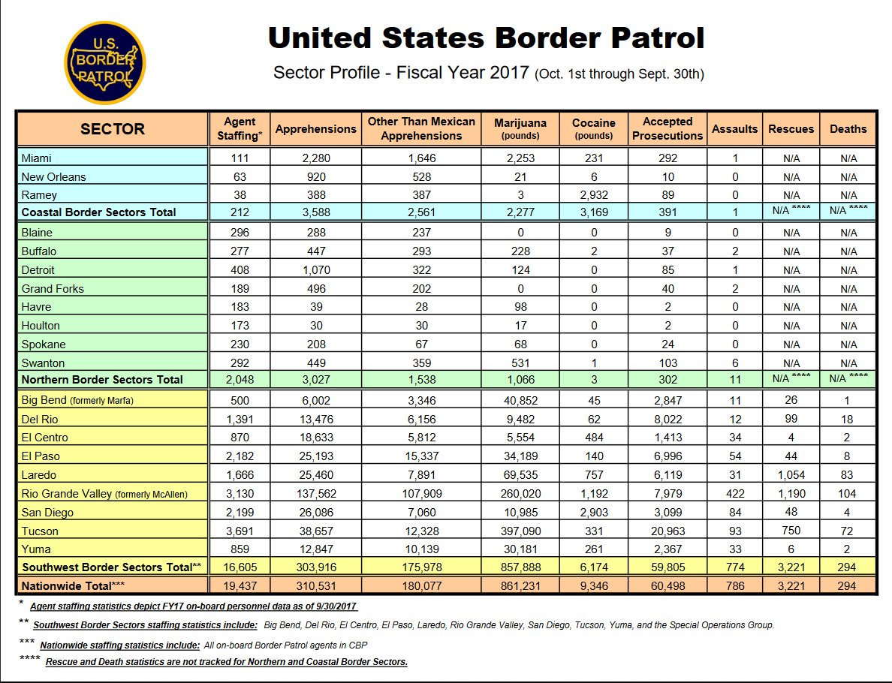
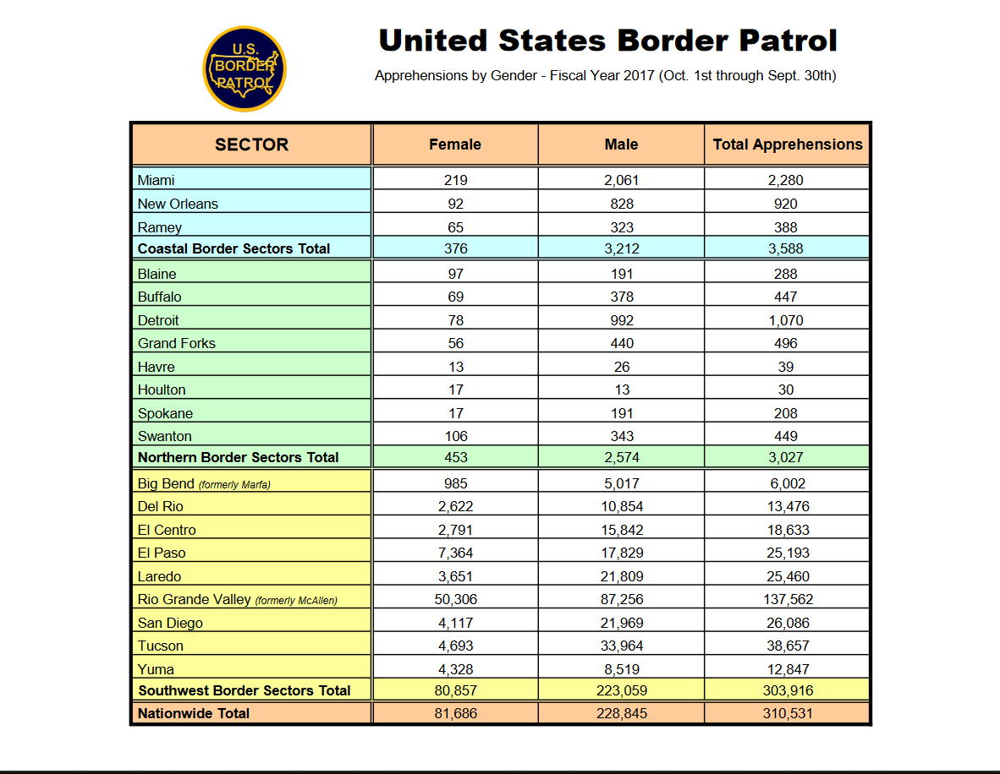

# Scraping Tables from PDFs

In Section \@ref(scraping-data-from-pdfs) we very briefly began working on scraping data from a PDF. We read in PDFs from Philadelphia's officer-involved shooting data and grabbed only the date of each incident. That data was written up like a report, with the date of the incident followed by a description of what happened. In the majority of cases when you want data from a PDF it will be in a table rather than descriptive paragraph. Essentially the data will be an Excel file inside of a PDF. This format is not altogether different than what we did before. We will be using regular expressions and `strsplit()` again to start handling this data. 

Let's first take a look at the data we will be scraping. The first step in any PDF scraping should be looking at the PDF and try to think about the best way to approach this particular problem - while all PDF scraping follows a general format you cannot necessarily copy and paste your code, each situation is likely slightly different. Our data is from the U.S. Customs and Border Protection (CBP) and contains a wealth of information about apprehensions and contraband seizures in border sectors. 

