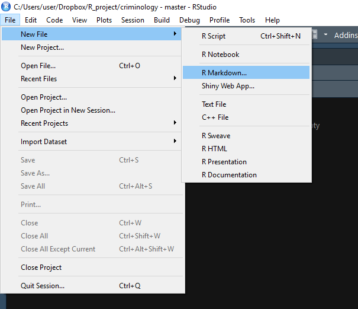
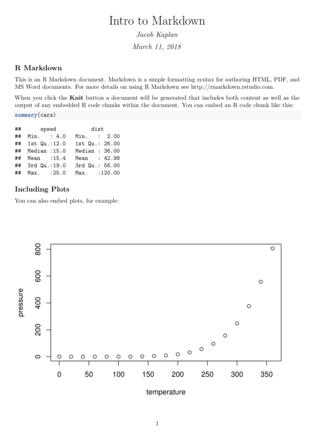
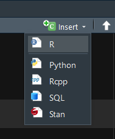

# R Markdown

When conducting research your end product is usually a Word Document or a PDF which report on the research you've done, often including several graphs or tables. In many cases people do the data work in R, producing the graphs or numbers for the table, and then write up the results in Word or LaTeX. While this is a good system, there are significant drawbacks, mainly that if you change the graph or table you need to change it in R **and** change it in the report. If you only do this rarely it isn't much of a problem. However, doing so many times can increase both the amount of work and the likelihood of an error occuring from forgetting to change something or changing it incorrectly. We can avoid this issue by using R Markdown, R's way of writing a document and incorporating R code within. 

This chapter will only briefly introduce R Markdown, for a comprehensive guide please see [this excellent book](https://bookdown.org/yihui/rmarkdown/). For a cheatsheet on R Markdown see [here](https://www.rstudio.com/wp-content/uploads/2015/02/rmarkdown-cheatsheet.pdf).

What R Markdown does is let you type exactly as you would in Microsoft Word and insert the code to make the table or graph in the places you want it. If you change the code, the document will have the up-to-date result already, reducing your workload. There are some additional formatting you have to do when using R Markdown but it is minimal and is well-worth the return on the effort. This book, for example, was made entirely using R Markdown. 

To open up a R Markdown file click File from the top menu, then New File, and then R Markdown...

d

From here it'll open up a window where you select the title, author, and type of output. You can always change all three of these selections right in the Markdown file after making your selection here. Selecting PDF may require you to download additional software to get it to output - some OS may already have the software installed. For a nice guide to using PDF with R Markdown, see  [here](https://medium.com/@sorenlind/create-pdf-.reports-using-r-r-markdown-latex-and-knitr-on-windows-10-952b0c48bfa9). 


When you click OK, it will open a new R Markdown file that is already populated with example plain text and code. You can delete this entirely or modify what's there to work with what you need. 


When you create that file as a PDF it will look like the image below.



R converted the file into a PDF, executing the code and using the formatting specified. In an R Script a `#` means that the line is a comment. In an R Markdown file, the `#` signifies that the line is a section header. There are 6 possible headers, made by combining the `#` together - a `#` is the largest header while `######` is the smallest header. As with comments, they must start the line. 

The word "Knit" was surrounded by two asterix `*` in the R Markdown file and became bold in the PDF because that is how R Markdown sets bolding - to make something italics using a single asterix like *this*. There are a number of different formatting options - if you're interested see the R Markdown book or cheatsheet linked earlier. 

## Code

The reason R Markdown is useful is because you can include code output in the file. Here is an example before we get into using code in Markdown. Below is an arbitrary graph.


```r
plot(1:100, type = "h", col = "yellow",
     main = "Awful graph title")
```


If you had put this graph in your Word document and decided to change it you would have to replace it every time you made a change. While this is a minor procedure, it adds up if you have many graphs or decide to change the graph frequently. Below is the same graph with just the title and color changed. If this were my thesis, I could have changed the original code and been assured that the most up-to-date graph (or table, etc.) is always the one included with the thesis. Change the code and never think about it. 


```r
plot(1:100, type = "h", col = "blue",
     main = "Great graph title!")
```


### Hiding code in the output

When you're making a report you generally only want to keep the output, not the code you used. 
The terminology used here will be `chunks`. This just means pieces of R code included among the plain text. All code must be in these chunks to be run. Inside a chunk, you can run any code you like. To make a chunk, click `Insert` and then `R`. It will add a chunk wherever your cursor is.

If you do not have the R Markdown file in the same folder as your data, you'll need to set the working directory in a chunk before reading the data. However, once a working directory is set, or data is read, it applies for all following chunks. You will also need to run any packages (using library()) to use them in a chunk.




Notice the three \` at the top and bottom of the chunk. Don't touch these! They tell R that anything in it is a code chunk (i.e. that R should run the code). Inside the squiggly brackets `{}` are instructions about how the code is outputted. Here you can specify, among other things (see reference guide for more), if the code will be outputted or just the output itself, captions for tables or graphs, and formatting for output. Include all of these options after the `r` in the squiggly brackets. Multiple options must be separated by a comma (just like options in normal R functions). The most common option is `echo` which says whether to show the code in the document or not. For the thesis you only want to show the output, not the code so include `echo = FALSE`. 

Here's an example, first with default options then with `echo = FALSE`.


```r
print("Hello")
#> [1] "Hello"
```


```
#> [1] "Hello"
```

Though you can't see it unless looking at the this chapter in it's raw format (this entire book is built using R Markdown), there are two code chunks, the second which has the `echo = FALSE` option. That is why you only see the code "print("Hello")" above the first result. 
When you make the output file, all code chunks will run and you will see the output included in the document. To run the code inside of RStudio, click the green right-arrow at the top-right of each chunk. This will run all code in that chunk.


## Figures and Tables

Above was a code chunk that makes a graph. The only addition you will likely make to this type of code is to add a caption. Do this by adding the option `fig.cap = ""` with the caption in the quotes.

<div class="figure" style="text-align: center">

<p class="caption">(\#fig:unnamed-chunk-7)This is an example figure caption</p>
</div>


There a number of packages that change how tables are displayed. We will use the basic `knitr` package. The easiest way to make a table in Markdown is to make a data.frame with all the data (and column names) you want and then show that data.frame. For this example we will subset the mtcars data (which is included in R) to just the first 5 rows and columns. The `kable` function from the `knitr` package will then make a nice looking table. With `kable` you can add the caption directly in the `kable()` function rather than using `fig.cap =""` in the chunk. The option `echo` is set to TRUE here so you can see the code without looking at the Markdown file itself. 


```r
library(knitr)
mtcars_small <- mtcars[1:5, 1:5]
kable(mtcars_small, caption = "This is an example table caption")
```


Table: (\#tab:unnamed-chunk-8)This is an example table caption

                      mpg   cyl   disp    hp   drat
------------------  -----  ----  -----  ----  -----
Mazda RX4            21.0     6    160   110   3.90
Mazda RX4 Wag        21.0     6    160   110   3.90
Datsun 710           22.8     4    108    93   3.85
Hornet 4 Drive       21.4     6    258   110   3.08
Hornet Sportabout    18.7     8    360   175   3.15


## Making the output file

To create the Word or PDF output click `Knit` and it will create the output in the format set in the very top. To change this format click the white down-arrow directly to the right of `Knit` and it will drop-down a menu with output options. Click the option you want and it will output it in that format and change that to the new default. Sometimes it takes a while for it to output, so be patient.


