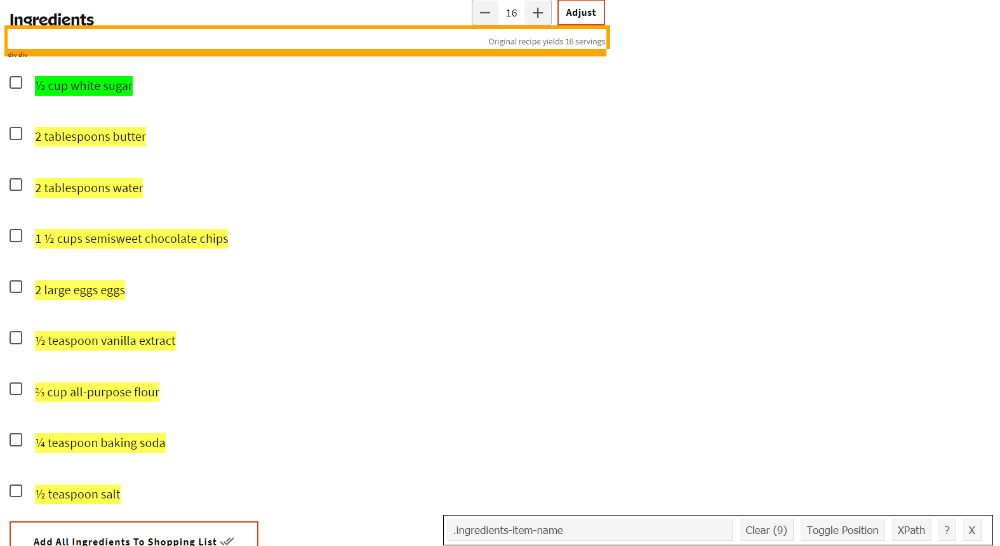
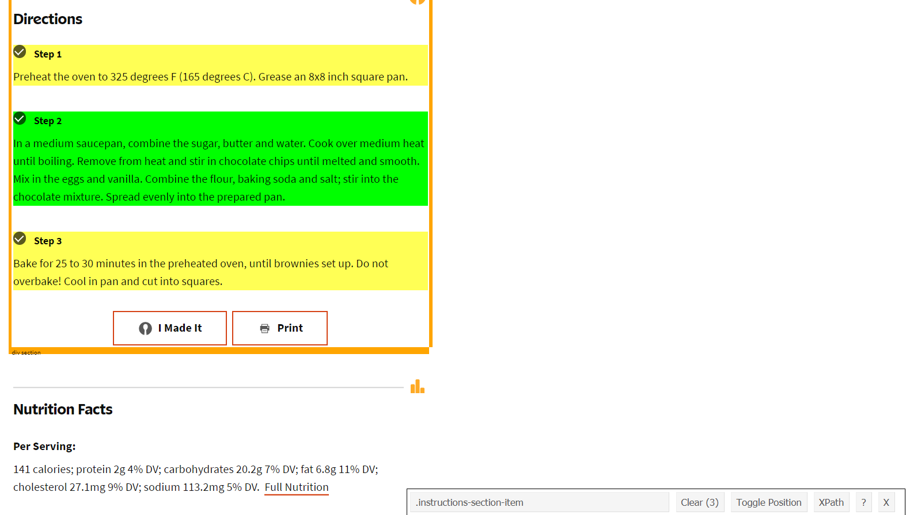

# (PART) Collect {-}

# Webscraping with `rvest`

If I ever stop working in the field of criminology, I would certainly be a baker. So for the next few chapters we are going to work with "data" on baking. What we'll learn to do is find a recipe from the website [All Recipes](https://www.allrecipes.com/) and webscrape the ingredients and directions of that recipe.     

For our purposes we will be using the package [`rvest`](https://github.com/tidyverse/rvest). This package makes it relatively easy to scrape data from websites, especially when that data is already in a table on the page as our data will be.

If you haven't done so before, make sure to install `rvest`.


```r
install.packages("rvest")
```

And every time you start R, if you want to use `rvest` you must tell R so by using `library()`.


```r
library(rvest)
```

Here is a screenshot of the recipe for the "MMMMM... Brownies" (an excellent brownies recipe) [page](https://www.allrecipes.com/recipe/25080/mmmmm-brownies/?internalSource=hub%20recipe&referringContentType=Search).


## Scraping one page

In later lessons we'll learn how to scrape the ingredients of any recipe on the site. For now, we'll focus on just getting data for our brownies recipe.

The first step to scraping a page is to read in that page's information to R using the function `read_html()` from the `rvest` package. The input for the () is the URL of the page we want to scrape. In a later lesson, we will manipulate this URL to be able to scrape data from many pages. 


```r
read_html("https://www.allrecipes.com/recipe/25080/mmmmm-brownies/")
#> {html_document}
#> <html lang="en">
#> [1] <head>\n<meta http-equiv="Content-Type" content=" ...
#> [2] <body class="template-recipe node- mdex-test karm ...
```

When running the above code, it returns an XML Document. The `rvest` package is well suited for interpreting this and turning it into something we already know how to work with. To be able to work on this data, we need to save the output of `read_html()` into an object which we'll call *brownies* since that is the recipe we are currently scraping. 


```r
brownies <- read_html("https://www.allrecipes.com/recipe/25080/mmmmm-brownies/")
```

We now need to select only a small part of page which has the relevant information - in this case the ingredients and directions.

We need to find just which parts of the page to scrape. To do so we'll use the helper tool [SelectorGadget](https://selectorgadget.com/), a Google Chrome extension that lets you click on parts of the page to get the CSS selector code that we'll use. Install that extension in Chrome and go to the [brownie recipe page](https://www.allrecipes.com/recipe/25080/mmmmm-brownies/?internalSource=hub%20recipe&referringContentType=Search).

When you open SelectorGadget it allows you click on parts of the page and it will highlight every similar piece and show the CSS selector code in the box near the bottom. Here we clicked on the first ingredient - "1/2 cup white sugar". Every ingredient is highlighted in yellow as (to oversimplify this explanation) these ingredients are the same "type" in the page. 



Note that in the bottom right of the screen, the SelectorGadget bar now has the text ".ingredients-item-name". This is the CSS selector code we can use to get all of the ingredients. 


We will use the function `html_nodes()` to grab the part of the page (based on the CSS selectors) that we want. The input for this function is first the object made from `read_html()` (which we called *brownies*) and then we can paste the CSS selector text - in this case, ".ingredients-item-name". We'll save the resulting object as *ingredients* since we want to use *brownies* to also get the directions. 


```r
ingredients <- html_nodes(brownies, ".ingredients-item-name")
```

Since we are getting data that is a text format, we need to tell `rvest` that the format of the scraped data is text. We do with using `html_text()` and our input in the () is the object made in the function `html_text()`.  


```r
ingredients <- html_text(ingredients)
```

Now let's check what we got. 


```r
ingredients
#> [1] "½ cup white sugar "                 
#> [2] "2 tablespoons butter "              
#> [3] "2 tablespoons water "               
#> [4] "1 ½ cups semisweet chocolate chips "
#> [5] "2 eggs "                            
#> [6] "½ teaspoon vanilla extract "        
#> [7] "<U+2154> cup all-purpose flour "    
#> [8] "¼ teaspoon baking soda "            
#> [9] "½ teaspoon salt "
```

We have successfully scraped the ingredients for this brownies recipes. 

Now let's do the same process to get the directions for baking. 

In SelectorGadget click clear to unselect the ingredients. Now click one of in lines of directions that starts with the word "Step". It'll highlight all three directions as they're all of the same "type" (to be slightly more specific, when the site is made it has to put all of the pieces of the site together, such as links, photos, the section on ingredients, the section on directions, the section on reviews. So in this case we selected a "text" type in the section on directions and SelectorGadget then selected all "text" types inside of that section.). Note that if you click on the instructions without starting on one of the "Step" lines, such as clickingo on the actual instructions (e.g. "Preheat the oven...") lines itself, SelectorGadget will have the node "p" and say it has found 25 'things' on that page that match. To fix this you just scroll up to see where the text "Best brownies I've ever had!" is also highlighted in yellow and click that to unselect it. Using SelectorGadget is often steps like this where you use trial and error to only select the parts of the page that you want.  



The CSS selector code this time is ".instructions-section-item" so we can put that inside of `html_nodes()`. Let's save the output as *directions*.


```r
directions <- html_nodes(brownies, ".instructions-section-item")
directions <- html_text(directions)
```

Did it work?


```r
directions
#> [1] "   Step 1   Preheat the oven to 325 degrees F (165 degrees C). Grease an 8x8 inch square pan.    Advertisement "                                                                                                                                                                                                                 
#> [2] "   Step 2   In a medium saucepan, combine the sugar, butter and water. Cook over medium heat until boiling. Remove from heat and stir in chocolate chips until melted and smooth. Mix in the eggs and vanilla. Combine the flour, baking soda and salt; stir into the chocolate mixture. Spread evenly into the prepared pan.   "
#> [3] "   Step 3   Bake for 25 to 30 minutes in the preheated oven, until brownies set up. Do not overbake! Cool in pan and cut into squares.   "
```

Yes! The final value in our vector is blank so we will have to remove that. 

## Cleaning the webscraped data

Now we just need to clean up the extra spaces to have nice, clean instructions for own brownies. Since the directions print out with the text `\n` at the end this indicates that it is the end of the line but we'll want to remove that, which we can do using `gsub()`. 


To remove the `\n` we simple find that in `gsub()` and replace it with a blank string. We'll do that for both ingredients and directions.


```r
directions <- gsub("\n", "", directions)
ingredients <- gsub("\n", "", ingredients)
```

And let's print out both objects to make sure it worked. 


```r
ingredients
#> [1] "½ cup white sugar "                 
#> [2] "2 tablespoons butter "              
#> [3] "2 tablespoons water "               
#> [4] "1 ½ cups semisweet chocolate chips "
#> [5] "2 eggs "                            
#> [6] "½ teaspoon vanilla extract "        
#> [7] "<U+2154> cup all-purpose flour "    
#> [8] "¼ teaspoon baking soda "            
#> [9] "½ teaspoon salt "
directions
#> [1] "   Step 1   Preheat the oven to 325 degrees F (165 degrees C). Grease an 8x8 inch square pan.    Advertisement "                                                                                                                                                                                                                 
#> [2] "   Step 2   In a medium saucepan, combine the sugar, butter and water. Cook over medium heat until boiling. Remove from heat and stir in chocolate chips until melted and smooth. Mix in the eggs and vanilla. Combine the flour, baking soda and salt; stir into the chocolate mixture. Spread evenly into the prepared pan.   "
#> [3] "   Step 3   Bake for 25 to 30 minutes in the preheated oven, until brownies set up. Do not overbake! Cool in pan and cut into squares.   "
```

It got rid of the `\n` but there's still white space at the start and end of our text. We can remove that using `trimws()`.


```r
directions <- trimws(directions)
ingredients <- trimws(ingredients)
```

And let's check again. 


```r
ingredients
#> [1] "½ cup white sugar"                 
#> [2] "2 tablespoons butter"              
#> [3] "2 tablespoons water"               
#> [4] "1 ½ cups semisweet chocolate chips"
#> [5] "2 eggs"                            
#> [6] "½ teaspoon vanilla extract"        
#> [7] "<U+2154> cup all-purpose flour"    
#> [8] "¼ teaspoon baking soda"            
#> [9] "½ teaspoon salt"
directions
#> [1] "Step 1   Preheat the oven to 325 degrees F (165 degrees C). Grease an 8x8 inch square pan.    Advertisement"                                                                                                                                                                                                               
#> [2] "Step 2   In a medium saucepan, combine the sugar, butter and water. Cook over medium heat until boiling. Remove from heat and stir in chocolate chips until melted and smooth. Mix in the eggs and vanilla. Combine the flour, baking soda and salt; stir into the chocolate mixture. Spread evenly into the prepared pan."
#> [3] "Step 3   Bake for 25 to 30 minutes in the preheated oven, until brownies set up. Do not overbake! Cool in pan and cut into squares."
```

Now *ingredients* is as it should be (note that all of the ingredient amounts - e.g. 2/3 cups - looks fine when in R. But when exporting it to PDF and on the site it shows weird characters like '<U+2154>'. This is because the conversion from R to PDF or HTML isn't working right. I'm keeping this unfixed as a demonstration of how things can look right in R but look wrong when moving it elsewhere. So when working on something that you export out of R (including from R to PDF/HTML or even R to Excel), you should make sure to check that no issue occurred during the conversion.) but *directions* has a bunch of space between the step number and the instructions. Let's use `gsub()` again to remove the multiple spaces and replace it with a colon followed by a single space.

We'll search for anything with two or more spaces and replace that with an empty string.


```r
directions <- gsub(" {2,}", ": ", directions)
```

And one final check to make sure it worked.


```r
directions
#> [1] "Step 1: Preheat the oven to 325 degrees F (165 degrees C). Grease an 8x8 inch square pan.: Advertisement"                                                                                                                                                                                                                 
#> [2] "Step 2: In a medium saucepan, combine the sugar, butter and water. Cook over medium heat until boiling. Remove from heat and stir in chocolate chips until melted and smooth. Mix in the eggs and vanilla. Combine the flour, baking soda and salt; stir into the chocolate mixture. Spread evenly into the prepared pan."
#> [3] "Step 3: Bake for 25 to 30 minutes in the preheated oven, until brownies set up. Do not overbake! Cool in pan and cut into squares."
```


In your own research, you will want to create a data.frame for nearly all data - this is also the way most statistical analysis packages expect data. In our case it doesn't make sense to do so. We'll keep them separate for now and in Chapter \@ref(functions) we'll learn to make a function to scrape any recipe using just the URL and to print the ingredients and directions to the console.  
