# (PART) Project Management {-}

In the next few chapters we'll cover proper project management including collaborating with other people (including yourself in the future who, in all likelihood, will forget a lot of the code you wrote), testing your code, and using the version control software Git.

# *Mise en place*

If you're familiar with cooking you might have heard the phrase [*mise en place*](https://en.wikipedia.org/wiki/Mise_en_place) which is French for "everything in its place". In cooking this concept means that you get everything - ingredients, pots, pans, bowls, utensils, etc. - needed to cook that item ready before you begin cooking. This saves time as you have everything you need in front of you and can just cook from start to finish without stopping to find something. This is also a useful idea in programming, especially when you're programming to conduct research. 

In this chapter, we'll cover how to get *mise en place* for your programming projects. First, we'll discuss how to think about the project and write out each step that we need to take to complete the project, and each output that we want (such as a graph or table). We'll write this out by hand and in plain English (or whichever language you are most comfortable in), before writing any code. Finally, we'll go over what is, in my opinion, the best way to organize your folders, data, and code. This method is particularly suited for research projects, so please feel free to modify my methods to suit your own needs and preferences. 

## Starting with a pencil and paper

This may seem counter-intuitive, but the best way to start any programming project - and in particular, research project - is to use a pencil and paper. On this paper you should outline every step (broadly speaking, not literally every line of code) that you'll take for the project. This is a useful process at the start of a project to step back from the code and think about the overarching goal of the project - and what you need to do to get there. For example, let's think about doing research using data from the US Border Patrol data (We'll actually work on this data in Chapter \@ref(scrape-table). We want to see if a policy change affected apprehensions at the border. On the data side, that'd require scraping and cleaning the PDFs. On the analysis side, we'd probably want to do a time-series graph showing apprehensions over time, and run a regression to see if the policy had a significant effect. So here we have four broad categories of work (scraping, cleaning, graphing, running a regression) for a fairly simple policy evaluation. Within each category you can make a number of subcategories. For example, in scraping you might want to add download the PDFs, see how each table relates to each other, figure out which parts of the tables are actually relevant, etc. We can probably break down these subcategories even further if we want. 

You essentially want to build a roadmap to follow - you can, of course, deviate from this roadmap if necessary - as you work on the project. This is useful for two reasons. First, writing out what you need to do will often clarify exactly what you need to do. Knowing that you'll want a time-series graph, for example, will mean that you need to have your data aggregated into a certain time unit. Knowing this before-hand will save you time as you'll have a tangible goal to work towards and don't have to keep stopping during your work to figure out what to do next.

And second, from my experience helping people at Penn with R, people - especially new programmers (and myself when I was first starting learning R, my first programming language) - can get overwhelmed with programming. One major problem they had is they couldn't articulate what they needed to do since they weren't familiar enough with R to know the right words.\footnote{Knowing the "right words" is surprisingly important when it comes to programming because it is crucial to finding help online. If you don't know how to subset, you can easily to find on Google as to how to subset in R. But if you don't know the word subset or how to describe what subsetting does well, it can be very tricky to find help (you won't even know what to Google!). These "right words" are, annoyingly, an important part of programming that I believe isn't given enough focus.} They knew the end goal, and what they had at the start, but couldn't articulate the path from start to finish. Writing out each step in plain language allowed them to know the path - it is simpler to know what steps you need to do to complete a project in plain language than to actually write the code (though this still requires experience to tell you a lot of the "minor" intermediate steps). Having a game plan helps people avoid being overwhelmed since they could do one step at a time (and feel accomplished at each step).

### Tables and graphs

One of the biggest challenges I had early in my PhD was figuring out what data was supposed to look like. I mean that literally. My first research project was analyzing if monthly crime in school buildings changed after a new policy was instituted that increased building security. The data I had available was incident-level so one row for every crime at the school, and I needed to convert it to the building-month level. The code for this is just to run `aggregate()` on the incident-level data and aggregate the data to building-month units. For some reason I just couldn't think of the proper way for my data to appear in the final data set which prevented me from figuring out what I needed to do. One solution to this - and useful even if you don't have this problem - is to draw out the graphs and tables you want before starting the code. Like writing out the steps for the code, drawing the graph will help you understand exactly how your data needs to look - and thus what code you need to write - for these graphs.

Below are two images from a recent project of mine with the tables and graphs that I wanted sketched out. Note that in the image showing my graphs I have crossed out the first graph. These sketches are just preliminary tools to help your work, you aren't chained to them. Like any tool, if it is no longer relevant or useful, find something new. For regression result tables especially, sketching these out help you think about what variables you will need to have to run the regression. For example, you may want to have control variables for demographics in your geographic unit (say, for the US Census). If we continue our example of using the US Border Patrol data, this means that you'll also need to grab, clean, and merge Census data to your other datasets. Sketching out the resulting tables and graphs is a good tool to figure out steps that you'll need to do for the project but may have not thought of. 

## R Projects

We've talked about projects in an abstract sense - that they are research papers or specific data exploration jobs. RStudio provides, a bit confusingly, something called an R Project which is merely a helpful way to organize folders for a specific project (paper, data exploration, etc.) that you do. When you do a project, I recommend keeping *everything* for that project in a single folder on your computer. Below is an image showing all of the folders I use for my various R work. As you can see from the file names, each folder is for a separate project, and there is not overlap between them - each project is independent. Within each folder is a structured way to organize the folders and files that I believe is one of the best ways to organize data for research projects. 

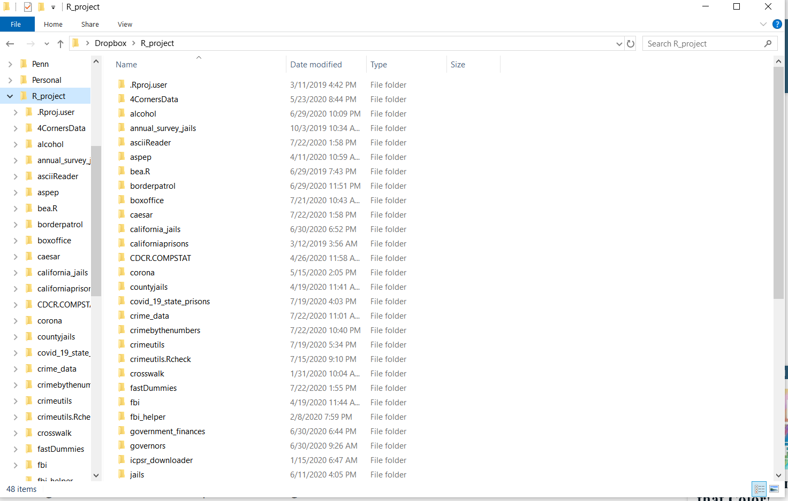

First, we'll explain how to set up an R Project through R Studio, and why you would want to do it. There are two main reasons to want to use an R Project. First, throughout this book I had you set your working directory so that R knew where to look for a particular file. In R Projects, by default the working directory is in that project's folder. So if you had a file `example.csv` in your project folder, you wouldn't need to set a working directory since R would already be looking that. This may be a minor time-saving method if you're working alone since you'd only need to set the working directory once when not using an R Project. But consider if you're collaborating with three people and you've shared your code. When using an R Project, it just runs. There is no figuring out what the issue is - and determining what the issue is will take them longer than setting the working directory itself. Second, it provides easy access to using the version control software Git, which we'll talk about in detail in Chapter \@ref(git).

To make an R Project, start by clicking the *File* button on the top left corner of RStudio and then click *New Project*. This will open up a window that has three options: New Directory, Existing Directory, and Version Control. New Directory says that the project we are making is going to be in a brand new folder that we're (R will do this automatically) going to create. This is the one you'll click on in the majority of cases. Existing Directory is for making a folder in an existing folder, which doesn't have too many useful cases. The Version Control is taking a project that someone else has created and downloading it to your computer. We'll cover this more in Chapter \@ref(git). 

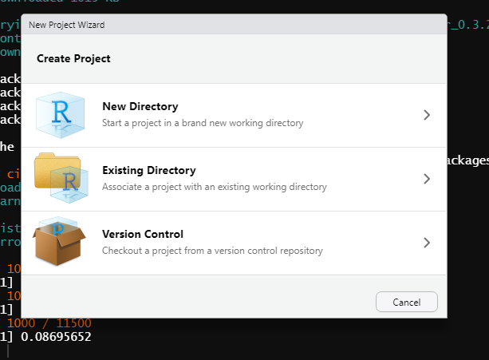

Once you've clicked New Directory, it'll change the window to ask you what type of project you want. The below two figures show all the different types of projects R can make (installing some R packages such as `bookdown` can add more types of projects to this list). R is very versatile and has project types ranging from the standard R Project to books and websites. We just want a standard project so click the New Project button at the top. 

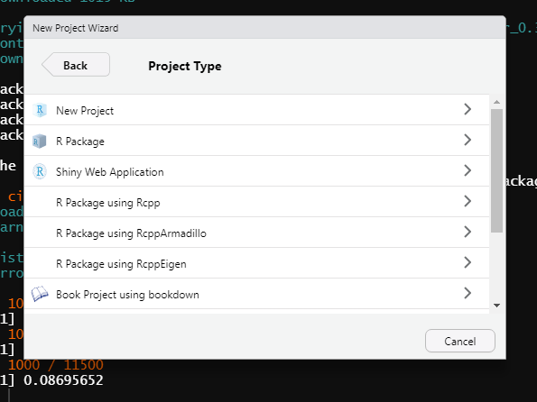

Now it'll have a window that says Create New Project up top. In the Directory name: section you write the name of your R Project. Keep this short and (though not required) follow normal R naming conventions such as all lowercase letters and underscores separating words. This will be the name of your folder so you want it descriptive enough to understand (and for collaborators to understand) what it is for, without being overly long. Once you have a name you can click the Browse... button on the right and go to the folder on your computer where you want to put this folder (ideally, you'll put it in a folder which is backed up by something like Dropbox). Make sure the *Create a git repository* checkbox is selected, and we'll explain why in Chapter \@ref(git). Click Create Project and R will make the project folder on your computer and open that project in RStudio.

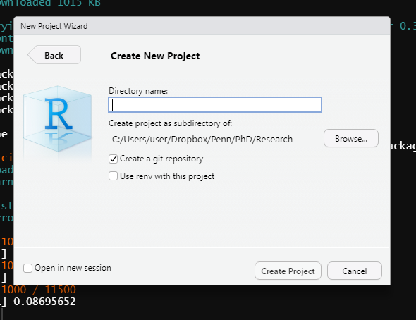

Below are images of a brand new R Project that I made called *example* that I put in my Desktop folder. The folder is now empty except for two files - .gitignore (which we won't talk about here) and *example* which is type "R Project" (and the full name would be *example.Rproj*). This is a **very** important file. Note that its name is the same as the R Project name that I made, and the same as the folder name on my computer. This file is essentially a shortcut that you click to open that R Project. It doesn't do anything more than open the R Project but this is the way you'll access the project every time you want to use it. Double-click this and the Project will open. 

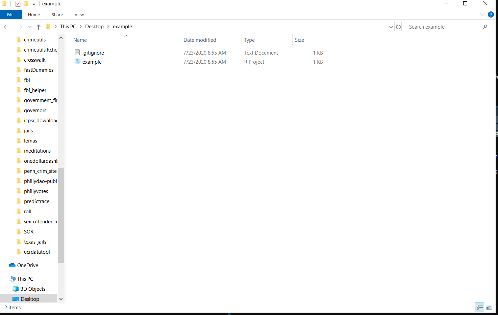

This RStudio session looks nearly identical to other sessions that we've used - and it nearly is identical. A few key differences can be found in the top left corner where it says "example - RStudio", indicating that we're in the *example* R Project. And then directly below the "Console" tab it says "C:/Users/user/Desktop/example/". This is the working directory of this project. I didn't set it, R just knew where it was. If you move this folder to a new folder (say, the Downloads folder) or if someone else downloads it to their computer, R will automatically change the working directory to the right one. You no longer have to worry about it.

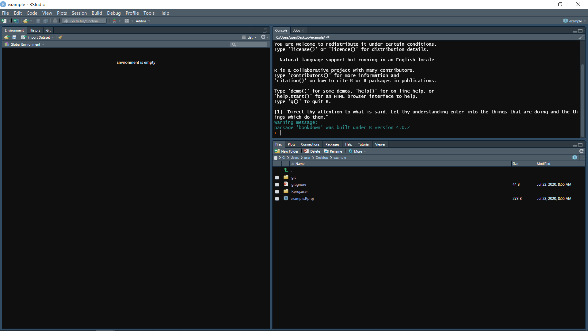

### Folders

Now that we have the R Project made, we need to start adding some R code and data files to the project so we can get started working. But first, let's talk about proper ways to organize the folder. I've added a few new folders to the new *example* R Project as the basic layout of my work process. This is for a research-oriented project so may not apply in your particular case. Organizing your folders (and as we'll see below, your code) is important so please play around with different ways to organize and find a way that works well for you. 

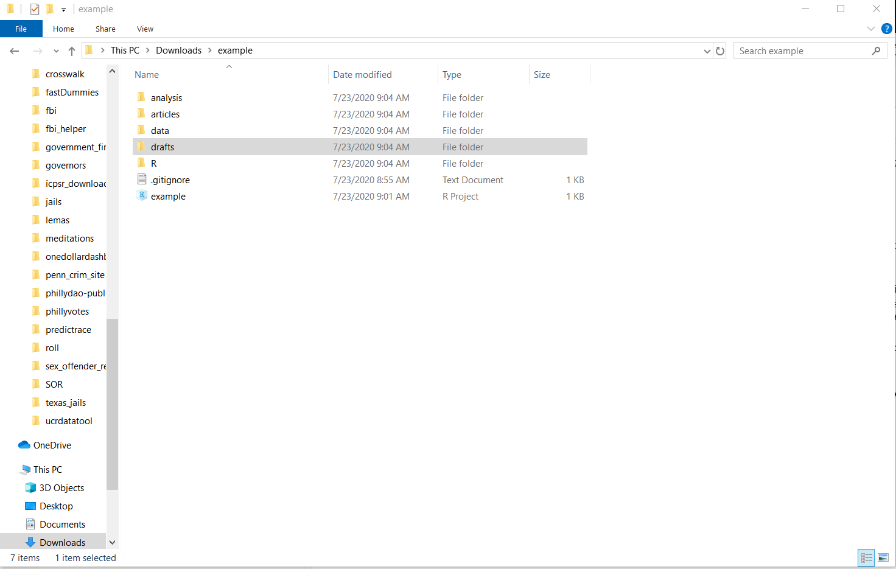

I've added five folders to the R Project folder: analysis, articles, data, drafts, and R (note that I moved it to the Downloads folder, and if I opened the project RStudio would know where the new working directory was). I tend to do my analysis using Stata (primarily because most of my co-authors use Stata instead of R so this is a way we can both work on the analysis) so in this folder I'd keep all of the .do (Stata) files to run the regressions. In articles, I put PDFs of every article I read that I use (or planned to use while reading it) for the paper I'm working on in this project. It's good to keep this organized to share with co-authors or just for easy reference after you've read it. It certainly takes time to find good sources for a lot of research, so you don't want to have to search again because you've forgotten which article you had a particular reference from or that was important to your study. While I recommend writing your papers in R Markdown (see Chapter \@ref(r-markdown)), you will need to create drafts of the paper to send to others (e.g. your collaborators or journals). The "drafts" folder is a good place to keep these versions - some journals require that you submit a Word Document with track-changes for a revise and resubmit so you will need to leave R Markdown occasionally to comply with these rules.

The final two important folders are "R" and "data". In the R folder - as you may have guessed - belong the various R scripts that you write during the project. In Section \@ref(modular-r-scripts), we'll talk in detail as to how to organize these scripts. Inside the "data" folder I made two subfolders: "raw" and "clean". The raw folder is where you'll store the data exactly as you got it (for cases where the data is acquired through webscraping, this isn't necessary). This folder will have, for example, the PDFs that you intend to scrape, and the .csv files downloaded from a different source. It is important to keep this data always unchanged (change only in your R code and save the output to a new file) so you can replicate your results from the original data. In the clean data is that final data output from your work to clean and manipulate (e.g. subset, aggregate) the data. It isn't strictly necessary to even output a final dataset - you could just rerun your code from the original data each time, and this is fine if your code is very quick to run - but I think it is important both for safekeeping and to be able to share with others. If you collaborate with people, you'll want to be able to send them the data so they can examine it without having to run all of your code themselves. 

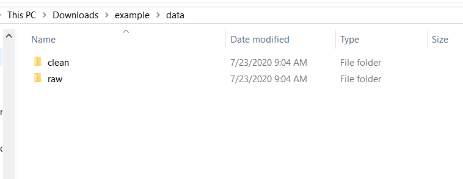

## Modular R scripts

If you are like many people who start programming, all of your code will be in a single R script. This is fine when you're first getting familiar with R and don't want to go searching for code in places when you're still uncomfortable with the language. As you become more familiar with R - and as your projects get more complex - you'll want to start making multiple R scripts in a single project. 

When you're writing a paper you don't just write one extremely long sentence. You break up ideas into paragraphs and divide groups of paragraphs into larger sections. This is useful in a paper to organize your thoughts and to make it readable for others. It's also useful when working since you know, for example, "Section 1 is done but I still need to finish Section 2 and the last   of Section 3." This way you don't confront working on the entire paper at once. You'll want to follow these lessons in the code you write, with each "section" of code being its own R Script and within a script split up code into particular "paragraphs". The end goal should be to have modular R scripts, with each script being independent (or relatively so) and the combination of these parts has all the code for your particular project. This is a bit of an abstract concept so let's use a real example from one of my recent projects.

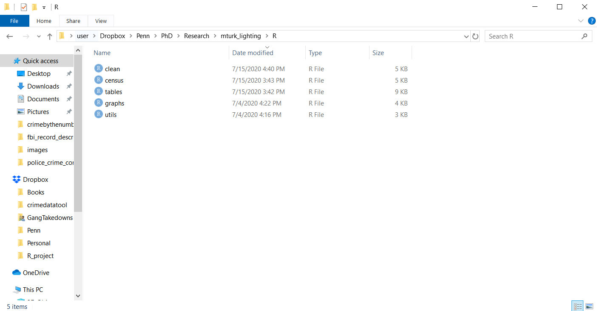

Above is a folder for the code used to analyze data for a paper examining perceptions of outdoor lighting. There are five R scripts in the folder - clean.R, census.R, tables.R, graphs.R, and utils.R - and these are the only ones used for this project.^[Analysis was done in Stata so there are separate files for that]. Each of these files (utils.R is an exception) has a particular role to play in the analysis of the data. The first file, clean.R is just code that cleans up the survey data and makes it ready to be analyzed and graphed. The census.R file has code that cleans Census data that my co-author and I use to compare our survey sample to the general public. As this is a separate dataset than the survey data, I have it in its own R script. tables.R and graphs.R are the code to make descriptive statistics tables and figures for the paper, respectively. While you could combine the code in these files into a single R script - and the code in each is not very long (shorter than the code in almost every chapter in this book) - it makes it harder to handle (much like reading an article with no space between the lines). I chose these files because they are doing fairly separate tasks, all with the goal of turning raw data into a research paper. 

This is an example of how I approach making R scripts, not necessarily the best way to do so. Even here, other decisions could be made. For example, I could have put the code from census.R into clean.R since they're both about cleaning data (and maybe rename clean.R to something like clean_survey.R). While you should try to make separate R scripts for broadly different tasks (regardless of how much code that task requires), you should experiment with how you prefer to separate these scripts, and balance between having one (or a few) super scripts that comprise everything with having too many scripts that do too little - this balance requires experience and experimentation so keep at it!  

## Modular code

In addition to having separate scripts for each major part of your project, you will want to organize each individual script into relatively modular parts. Whereas each script is like a book chapter, the code inside the script should be like paragraphs, separated into distinct chunks (similar to the chunks in an RMarkdown file). For example, let's say you have some raw data and want to subset it, change some values (e.g. renaming F to Female, M to Male), and then aggregate to a larger geographic area. This is a three-step process - subset, change, aggregate - so you'll want to have three different parts of your R Script dedicated to this. Now, if this is a simple process (and it will always depend on the data and what you want to do with it), you may want to have each step in its own Section (as we'll discuss next). If it's relatively simple and takes only a few lines per step, you'll likely just want to have a line break between steps and identify your choices in comments. It's hard to give precise rules on how to do this as it really does depend on personal preference - I think having more comments and line breaks early in your experience is better as it's a good foundation, and you can alter it to suit your preferences as you get more experience. 

The goal of making modular code is to avoid having a large amount of code without breaks or comments - that'd be like reading a run-on sentence. We'll talk about comments more in Section \@ref(comments), but here you should explain your choices (e.g. "Subset to only violent crime and property crime") to inform collaborators (other people and yourself in the future who will likely forget what or why you did something), but without writing too much. Generally the rule of thumb is to have comments for why you did something, not explaining what as the what can be deduced from looking at the code. I think a mix of what and why is helpful as it's quicker than looking at the code, especially if your code is complex. Like a lot of your work, however, this depends on the project and your audience - if you're working with someone new to R, having more comments explaining what you did is helpful.

### Section Labels

When you have major parts of a script, you should have something to indicate that this is a distinct section from other parts. RStudio has a handy tool to help make that distinction by creating Sections in your R Script. Press the keys Control+Shift+R (Command+Shift+R in a Mac) and it will open up a window where you can set a section label (note that this will only work in an R Script, not an RMarkdown file). Enter in the name of the section you want and click OK and it'll add that to where your cursor was in the R Script. You can also do this by simply adding four dashes (----) on the end of a comment

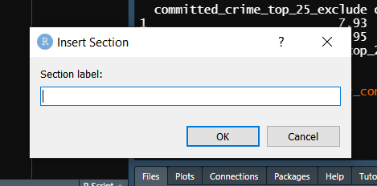

Sections are more than just commented parts of a Script. Note that in the photo below, there is both the Section label in the R Script and that same label in a new section of the Source tab on the right. You can get to this section by clicking on the button on the very top right, the one that looks like a bunch of misaligned lines. In here, it shows all the Sections that exist and clicking the Section name will move to the start of that Section in your R Script. If you have a long script (which is generally unadvised but sometimes can't be helped), this is an easy way to find a particular part of your code. 

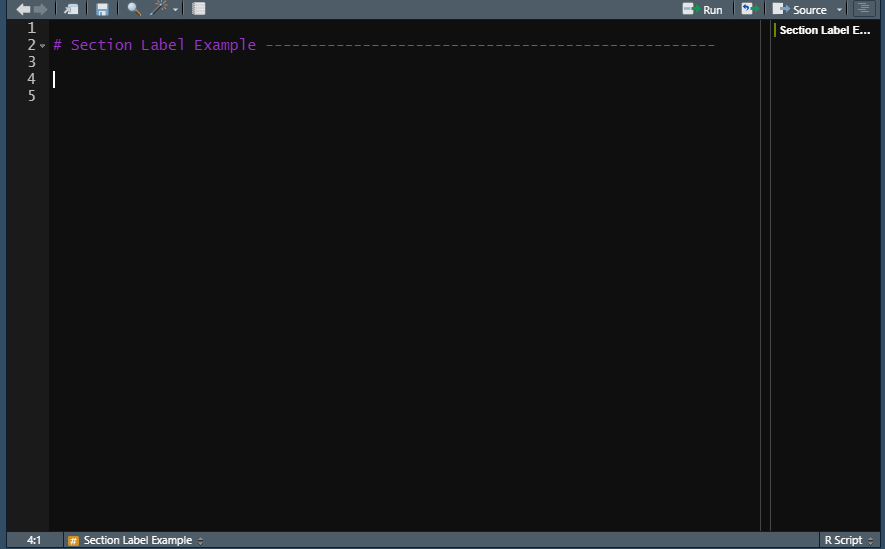

### Helper R Scripts

As part of making code organized, I find it helpful to make two R scripts in each (or most) of my projects to hold helper functions or objects - and I call these utils.R and utils_objects.R (utils stands for utility as these are helpful pieces of code for the project). These files should be for code that will be used in multiple R Scripts, so you want them in a single place rather than copying them over in each script where you need them.

In utils.R, I keep functions that are either auxiliary (such as code to check data by printing out a set of outputs) or code that is used infrequently (such as loading several files and merging them together at the start of an R Script) where I don't want them in the main file. In utils_objects, I put useful objects such as a vector (`c()`) of values that I will use to subset. For example, if I wanted to subset all violent crimes from a dataset, I would need to know what crimes in that data are considered violent, put them as strings in a vector, and subset to only rows that match those strings. In utils_objects.R I could make an object with this vector, such as `violent_crimes <- c("murder", "rape", "robbery", "assault")`. 

If you want to run utils.R or utils_objects.R (or any .R file) in a different R script, you can use the `source()` function which makes R run the entire script inputted in the parentheses. Just put the file name (in quotes) in the parentheses and it will run. For example, if we want to run utils.R, we'd write `source("utils.R")`. If that file was in the "data" folder of our R Project, we'd write `source("data/utils.R")` so R knew to look in the "data" folder for the file. 
